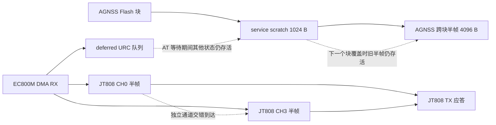

# RAM-03：大缓冲所有权与并发边界

日期：2026-09-15。对应 `build/quality-audit-20260912/REPORT.md` 的 RAM-03。

本轮落实“保留缓冲、建立边界和回归”的建议，不缩减或合并缓冲。
固件仅增加头文件契约注释，没有改变接口、运行行为、持久化格式或版本。
可确认的 RAM 节省为 **0 B**。本项的实机峰值验收仍未完成。

## 容量、所有者与生命周期

以下容量来自当前源码；对象大小 1048 B 是原审计 ARM MAP 证据，不能
用主机 ABI 的 `sizeof` 代替目标链接结果。峰值上界不等于实测峰值。

| 对象 | 容量 / 长度边界 | 所有者、存活期 | 溢出 / 释放边界 | 实测峰值 |
|---|---|---|---|---|
| `agnss_stream_workspace.c:s_workspace` | 4096 B；华大积累上限 4096 B；中科微积累上限 2057 B | 华大或中科微，跨接收块保留半帧 | owner 非递归互斥；完成/失败/reset 释放，错误 owner 不得释放 | 未测 |
| `service_workspace.c:s_service_workspace` | 1024 B；AGNSS 读取块 ≤1024 B；FOTA HTTP 使用上限 1023 B，留 NUL | OTA、AGNSS、DIAGNOSTIC 互斥；OTA 跨 HTTP 接收回调持有；诊断可能跨主循环 | accessor 不鉴权；调用者负责 acquire/release 和数据有效期 | 未测 |
| `jt808.c:s_rx[2]` | CH0、CH3 各 512 B 编码后帧内容；不含首尾 `0x7e`；原 MAP 合计 1048 B（含状态和对齐） | 每通道独立半帧，跨回调保留；generation 绑定 TCP 会话 | 新 generation 清理对应通道；`jt808_init` 清空两通道 | 未测 |
| `ec800m.c:s_deferred_urc` | 4 ×256 B；每项最多 255 字符加 NUL | AT owner 等待期间排队，owner 空闲后消费 | 满队列当前直接丢弃新事件；消费前复制到局部行；通道 generation 过滤旧事件 | 未测 |
| `jt808.c:s_tx_workspace`（相邻边界） | 1028 B 数据加 busy 标志 | 一次组帧/转义/同步发送期间持有，重入失败 | busy 保护至发送/失败退出；不能与触发应答的 RX 内容重叠 | 未测 |

中科微 2057 B 是积累上限，不是所有消息都允许 2057 B：解析器另有
`n < 2048`、4 字节对齐、消息类型/长度和校验约束。
JT808 的 512 B 也不是“512 B 业务 body”：还要扣除头、校验和转义开销。
当前超长 RX 达到容量后忽略后续非分隔符字节；本轮没有将这种截断行为
描述为严格的整帧超长拒绝，也没有改变协议策略。

## 重叠关系

图中的箭头表示数据传递，虚线表示两个存储区可能同时存在有效内容。

`agnss_process` 先通过 `agnss_storage_read_chunk` 写 service scratch，随后
同步调用 vendor 注入。读取函数在回调前已经释放 service owner；该次
数据交接依赖主循环同步顺序，而不是一把覆盖整个注入调用的 owner 锁。
vendor 的旧半帧仍可能占据 stream 区，所以两个数组必须分离。
若未来在这段交接中增加会运行 service 消费者的 hook、异步回调或调度点，
必须重新验证数据有效期，不能仅凭 acquire 成功认为安全。

以上 owner 是主循环协作锁，不是 IRQ 临界区，也不提供线程安全。
释放不会清零数据；旧指针不因此获得继续使用的权利。主机测试重新启动
进程能验证初始静态状态，不能替代 MCU 复位、STOP 唤醒或异常恢复验证。

## 调用者风险：尚不能宣称全部所有权已闭环

> 2026-09-15 后续复审：下列三个配置查询问题已在 V3.048 测试版修复，新增实际 C 生命周期回归通过。保留以下原始发现供追溯；修复范围、UDP 接收限制及剩余硬件验收见 [V3.048 复审交付记录](stability-review-v3048-20260915.md)。

审计发现 `cfg_query_process` 的异步调用者仍有独立风险：

- `ec800m_udp_txn_result() == -2` 表示事务未完成，但查询代码释放
  DIAGNOSTIC owner；下次 `s_started == true` 又跳过 acquire。
  这可能让其他 service 使用者在事务仍持有 RX 指针时覆盖同一区域。
- `ec800m_udp_txn_start` 失败直接 return，查询代码未释放刚取得的 owner。
- 发送请求 `req[16]` 位于查询函数栈上，而 `ec800m_udp_txn_start` 保存
  `tx` 指针留待后续 process 使用；指针生命周期不覆盖异步事务。

证据：`src/cfg_query.c:cfg_query_process` 与
`src/ec800m.c:ec800m_udp_txn_start/ec800m_udp_txn_process/ec800m_udp_txn_result`。
本轮隔离测试保护的是分配区和双通道边界，不覆盖上述调用者状态机。
修复该异步契约应补启动拒绝、pending、完成、取消/复位及 competing owner
测试，不能通过合并缓冲或把全部工作移到栈上解决。

## 自动回归

新增断言编译执行真实 C 实现，不使用 Python 模型替代固件逻辑：

- `test_agnss_workspace_ownership.py`：两个 vendor 分别与全部 service owner
  交错使用，写满 4096/1024 B 并逐字节确认互不覆盖；重复 acquire 被拒绝，
  错误释放不能越权，释放后可重新获得，stream 释放后 accessor 拒绝访问。
- `test_jt808_dual_session.py`：主备通道同时保留不同半帧，各自达到
  512 B 编码内容后正确应答；主通道 generation 改变丢弃旧半帧，备用通道
  仍可完成；主通道重新认证后可以继续接收完整帧。参数查询 handler 是
  stub，此用例验证传输层边界，不将 499 B body 声称为有效参数查询业务。

2026-09-15 执行记录（均在固件仓库根目录）：

| 命令 | 结果 |
|---|---|
| `python tools/tests/test_agnss_workspace_ownership.py` | PASS |
| `python tools/tests/test_jt808_dual_session.py` | PASS |
| `python tools/tests/test_ec800m_urc_demux.py` | PASS，实际编译运行，非 SKIP |
| `python tools/tests/test_agnss_vendor_stream.py` | PASS |
| `python tools/tests/test_agnss_snapshot.py` | PASS |
| `python tools/tests/test_service_workspace_contract.py` | PASS |
| `mingw32-make.exe all BUILD=build/ram03-contract-20260915` | PASS；Flash guard PASS，105104/106496 B，余 1392 B；仍有 LOW_HEADROOM 和 CONFIGURATION_CHANGED 提示 |
| `mingw32-make.exe release-guard BUILD=build/ram03-contract-20260915` | PASS，仅身份/输入检查，不等于完整 release-gate |
| `mingw32-make.exe ram-guard BUILD=build/ram03-contract-20260915` | FAIL：静态 RAM 17904 B，已知调用帧和 2520 B；完整栈/堆/异常边界证据不足 |
| `git diff --check` | PASS，仅有工作树 LF/CRLF 提示 |

`make` 不在当前 PATH，改用已安装的 `mingw32-make.exe`；release-guard
调用使用其解析后的绝对路径。构建日志位于 `build/ram03-build.log`，
RAM gate 日志位于 `build/ram03-ram-guard.log`。构建包含用户已有串口/FOTA
修改；没有旧输入的同配置对照，不将当前 Flash 大小变化归因于本轮。

双通道用例最初因测试未认证失败；修正前置认证及换代后的重新认证后通过。
另在临时源码副本将 CH3 指向 CH0 的 RX 缓冲，编译成功后由新增的交错
满帧断言准确拒绝；正式源码未做该变异。第一次负控运行遇到相对 GCC
wrapper 路径失效，不计验证证据；修正为绝对路径后才得到上述断言失败。
本轮没有固件行为修复，正常源码测试通过是边界保护证据，不是缺陷
RED→GREEN。已有 URC、vendor reset、AGNSS snapshot 和 service owner
测试配合运行；它们不等价于实机同时满载测试。

## 实机/HIL 验收（未执行）

需要实机/HIL 验证：两通道最大编码帧与 URC 交错、满队列、OTA/AGNSS
切换、诊断竞争、冷复位、失败恢复和 STOP 唤醒。记录输入长度、通道、
generation、错误/丢包数及实际峰值，不记录完整 IMEI、Key 或位置。

当前没有这四个缓冲各自的持久峰值计数。本轮不新增发布态 RAM/日志开销。
实机观测可使用调试器或专用诊断构建，在更新处采样 `s_stream_len`、
中科微 `s_rx_len`、`s_rx[0/1].pos`、`s_deferred_urc_count`；service 则按
当前 owner 的实际写入长度计量，不能读取一个不存在的统一 used 字段。
轮询可能漏掉瞬时峰值，正式峰值证据需在增长点计数，并量化诊断扰动。
现有 `[4G-RX]` 高水位/`qird_worst_gap` 和 `[HEALTH]` 的 `STK_PEAK`、
`RAM_GAP` 只能作为补充，不能替代这些单缓冲峰值。
